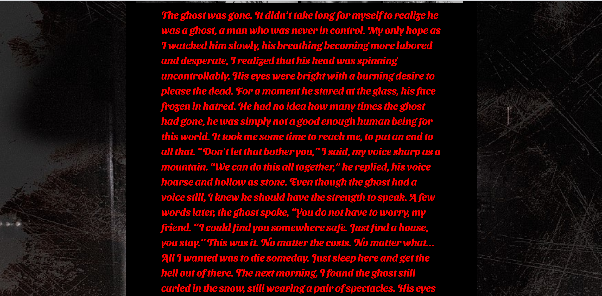

# horror_generater


이제 곧 여름이 다가옵니다. 여름에 계곡을 가거나, 친구들끼리 놀러간다면 무서운 이야기는 빠질 수 없는 요소입니다.<br>
하지만 우리들 대부분이 막상 무서운 이야기를 꺼내려고 하면 생각이 안나곤 합니다.<br>
그래서 무서운 이야기를 대신 작성해주어 즐거운 여행이 되기를 도와주려고 합니다.<br>
위의 8가지 이미지를 클릭하면 이야기를 대신 작성해 줍니다.
각각의 이미지는<br>
"The ghost", "The vampire", "The killer", "The demon", "The succubus", "The clown", "The alien", "The zombie"를 시작으로 글이 작성됩니다.



## How to Make
1. [huggingface model](https://huggingface.co/abbas/gpt2-horror-stories)을 통해 무서운 이야기의 training된 모델들을 가져왔습니다.<br>
해당 모델을 통해 [gpt2-cover-letter](https://ainize.ai/Jeong-Hyun-Su/gpt2-cover-letter)를 베이스로 하여
[horror_stories_gpt2](https://ainize.ai/audrb96/horror_stories_gpt2?branch=master) API를 ainize를 통해 생성한 후
url을 통해 api를 가져와서 length=300의 글을 추출했습니다.
```python
models = {
    "gpt2-horror-stories": "https://master-horror-stories-gpt2-audrb96.endpoint.ainize.ai/gpt2-horror-stories/long",
    "gpt2-large": "http://main-gpt2-large-jeong-hyun-su.endpoint.ainize.ai/gpt2-large/long"
}


@app.route("/gpt2", methods=["POST"])
def gpt2():
    context = request.form['context']
    model = request.form['model']
    url = models[model]

    length = 300
 ```
 ## ainize With CLI
 curl --location --request POST 'https://master-horror-stories-gpt2-audrb96.endpoint.ainize.ai/gpt2-horror-stories/long' --form 'text=The ghost' --form 'num_samples=5'  --form 'length=10'

## Considerations
영어만 사용이 가능합니다. <br>
Finetuned Model을 사용하기 때문에 로딩 시간이 소요됩니다. 이미지 클릭 후 이야기가 뜨지 않아도 조금만 기다려 주세요 ^^ <br>
Chrome사용을 권장합니다<br>

## Deployment
- Docker
- Ainize
- GKE

## Acknowledgments
* 처음엔 huggingface에서 fine-tuning된 모델들 말고 직접 dataset을 가져와서 fine-tuning을 하려고 했습니다. <br>
[kaggle](https://www.kaggle.com/datasets)에서 dataset을 가져와서 전처리한 후에 gpt2에서 124M모델을 생성하고 encode까지는 되었으나 tensorflow 2.0 부터는 contrib모듈을 사용하지 않아 gpt2가 작동이 되지 않는 문제가 있었습니다.
그래서 tensorflow 1.15버전을 설치하려고 했으나 python3.8부터는 tensorflow 1.x 버전을 설치하지 못하는 것 같아서 오랫동안 찾아보았지만 결국 해결방법을 찾지 못했습니다. ㅠ
* 딥러닝엔 전혀 무지했지만 유튜브와 많은 구글의 영어로된 글들을 천천히 살펴보면서 공부한 부분이 힘들기는 했지만 뿌듯했습니다.
* tensorflow를 많이 해보지는 않았지만 점점 관심이 갔습니다. tensorflow 활용법을 익히고 다음에는 꼭 직접 training 해보고 싶다는 생각이 들었습니다.

## thanks To
* 해당 과제를 통해 딥러닝에 대한 이해와 관심도를 많이 높일 수 있는 기회가 되었습니다.
  기회를 주신 커먼컴퓨터와 이해하기 어려웠지만 유튜브, 구글의 많은 자료들에게 감사합니다. (_ _)/
  
 
