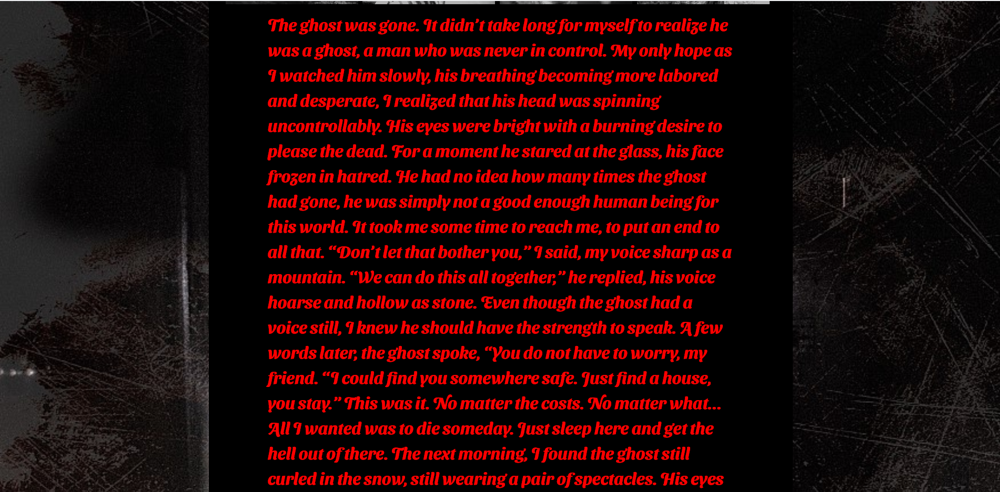

# horror_generater


Summer is coming soon. If you go to a valley or hang out with your friends in summer, scary stories are an essential factor.<br>
But when most of us try to bring up a scary story, we can't think of anything.<br>
So I'm going to write a scary story instead and help you have a good trip.<br>
Click on the eight images above to fill out the story.
Each image is <br>
Writing begins with "The ghost", "The vampire", "The killer", "The demo", "The succubus", "The clown", "The alien", and "The zombie".



## How to Make
1. [huggingface model] (https://huggingface.co/abbas/gpt2-horror-stories)) I brought training models for scary stories.<br>
[gpt2-cover-letter] (based on https://ainize.ai/Jeong-Hyun-Su/gpt2-cover-letter)) through that model.
[horror_stories_gpt2] (https://ainize.ai/audrb96/horror_stories_gpt2?branch=master) API created via ainize)
The api was imported via url to extract the text of length=300.
```python
models = {
"gpt2-horror-stories": "https://master-horror-stories-gpt2-audrb96.endpoint.ainize.ai/gpt2-horror-stories/long",
"gpt2-large": "http://main-gpt2-large-jeong-hyun-su.endpoint.ainize.ai/gpt2-large/long"
}


@app.route("/gpt2", methods=["POST"])
def gpt2():
context = request.form['context']
model = request.form['model']
url = models[model]

length = 300
```
## ainize With CLI
curl --location --request POST 'https://master-horror-stories-gpt2-audrb96.endpoint.ainize.ai/gpt2-horror-stories/long' --form 'text=The ghost' --form 'num_samples=5' --form 'length=10'

## Considerations
Only English is available. <br>
Loading time is required because the Finetuned Model is used. Please wait a little bit after clicking on the image even if the story doesn't come up. ^^ <br>
We recommend using Chrome<br>

## Deployment
- Docker
- Ainize
- GKE

## Acknowledgments
* At first, instead of fine-tuned models from the hoggingface, we tried to get a dataset and do fine-tuning. <br>
[kaggle] (after getting the dataset from https://www.kaggle.com/datasets) and pre-processing it, creating a 124M model in gpt2 and encode, but from tensorflow 2.0 there was a problem that gpt2 did not work because the control module was not used.
So I tried to install version 1.15 of tensorflow, but I couldn't install version 1.x from python 3.8, so I looked for it for a long time, but I couldn't find a solution. ㅠ
* Although I was completely ignorant of deep learning, I was proud of my study by slowly looking at YouTube and many English articles on Google.
* I haven't done much tensorflow, but I was getting interested. I wanted to learn how to use tensorflow and train myself next time.

## thanks To
* The challenge has given us an opportunity to gain a greater understanding and interest in deep learning.
Thank you for the opportunity, Common Computer, and many materials from YouTube and Google.
